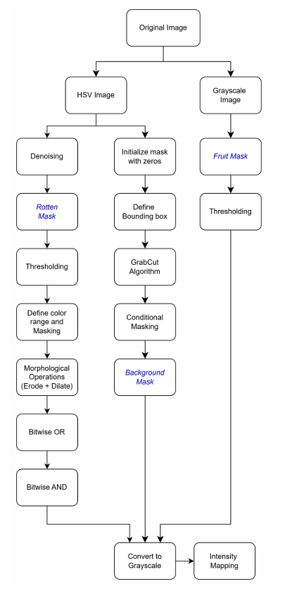

# Rotten fruit segmentation

This task focuses on developing an algorithm that automatically segments fruits and rotten regions using traditional image processing techniques. Without relying on more advanced methods like deep learning, the emphasis lies on selecting relevant features, defining areas of interest and creating the right filters. 

## Method Pipeline

